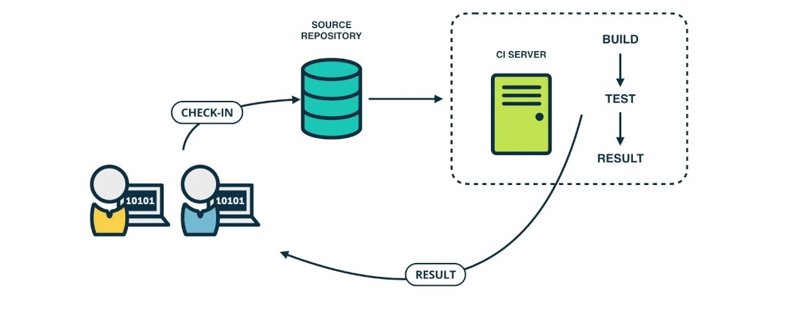

- CI is a development practice that requires developer to integrate code into a shared repository, multiple times.
- Each code push is then verified by a automated build system, allowing team to detect problem early.  
  By integrating regularly, we can detect error quickly and locate them more easily.
- Continuous integration is cheap, not integrating continuously is expensive.
- If we don't follow a continuous approach, you will have a longer periods between integration.  
  This makes it exponentially more difficult to find and fix problems, such integration problems can easily knock a project of schedule or cause it to fail altogether.

## Advantages of CI
1. Increase visibility, enabling better communication.
2. Catch issue early, spend less time debugging and more time in adding feature.
    - Build a solid foundation.
    - Stop waiting to find out if your code's going to work.
    - Reduce integration problems.
    - Reduce the risk of bugs.
3. Making continuous integration works, we need:
    - Source code repository
    - A check-in process
    - An automated build process
    - A willingness to work incrementally.
4. It supplements the checks like:
    - Automated code quality tests.
    - Check test cases.
    - Syntax style review tools
    - Lints and formats Codebase

## Example : [Travis](https://travis-ci.org/)
- Travis CI is a CI platform that automates the process of software testing and deployment of applications. It’s built as a platform that integrates with your GitHub projects so that you can start testing your code on the fly. 
- With customers like Facebook, Mozilla, Twitter, Heroku, and others, it’s one of the leading continuous integration tools on the market.

### Key Features

- Free for public open source projected on GitHub
- As simple as signing up, adding a project, and you can begin testing
- Bilingual support so your code runs smooth across all versions
- Automated pull request verification
- Works with Email, Slack, HipChat and others for easy notifications
- Extended API and CMD tools for custom management

> Cost: Free for open repositories, Enterprise for private

