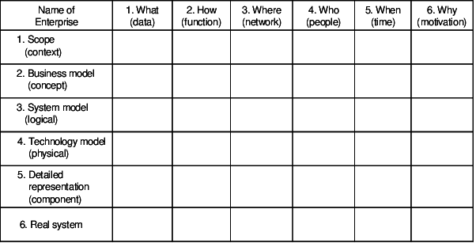

- Frameworks  help people to organize and assess completeness of integrated models of their enterprises.
- An Architectural Framework gives a skeletal structures that defines suggested architectural artifacts, describes how those artifacts are related to each other and provides generic definition for what those artifacts might look like.

> How to create and use an enterprise architecture ?

> Principles and practices for creating and using architectural description of the system.

## Purposes of Frameworks
1. Organize integrated models of an enterprise.
2. Assess completeness of the descriptive representation of an enterprise.
3. Understand an organization of a system.
4. Assist in identification and categorization.
5. Help to manage complexity.
6. Identify the flow of money in the enterprise.
7. Provide a communication mechanism.

## Zachman Enterprise Architecture Framework

Generic Diagram

Empty Zachman Framework

- It is an EAD which provides an formal and highly structured way of viewing and defining an enterprise.
- It is an schema for organizing architectural artifacts(`design documents, specifications, modes`) that takes into account both, whom the artifacts targets (`business owner, builder`) and what particular issue (`data, functioning`) is being addressed.
- ROWS and COLUMNS are the basic units of the framework.
- ROWS describes the different (`perspectives, views, roles`) of the enterprise.

### Architecture
#### Scope Context
- Scope describes the system's vision, missions, boundaries, architecture and constraints.
- The scope states what the system is trying to achieve.
- It is called a black box model, because we see the inputs and outputs of the system, but not the internal workings of the system.

#### Business Model
- It shows goals, strategies and processes that are used to support the mission of the organization.

#### System Model
- It contains requirements, objects, activities and functions that implement the business model.

#### Tech Model
- It contains the constraints of human, tools, hardware, software and network that implements the system model.

#### Detailed Representation
- It presents individual, independent components that can be allocated to contractors for implementation.

#### Real System
-  It depicts the operational system under consideration.

## GEAF
- Government Enterprise Architecture Framework
- It promotes consistency in the government models and its business process, services and infrastructure.
- It guides our transformation towards coherent (संसक्त) digital government.
- It guides an organization transition to work in connected and digital world.
    - It provides a unifying common language.
    - Categorizes and describes the business processes and services.
    - Categorizes and describes the relevant standards and guidelines.
    - Defines set of reference models and patterns.
    - Defines and identifies government business capabilities.

### Components
1. A layer architecture framework
2. Reference architectures
3. Toolkit and Guidelines
4. GEA Standard References

### Benefits
1. Helps in to understand your current business.
2. Identify opportunities for change.
3. Model your business goals and the capabilities and investments you need to deliver them.
4. Design a future operating model that is technically and strategically aligned with all of government’s programs and services.

### Architecture Resources
1. Governance and Maturity Tools
2. Information: Discovery Process guidelines and templates
3. Information: Assets Catalogue Template
