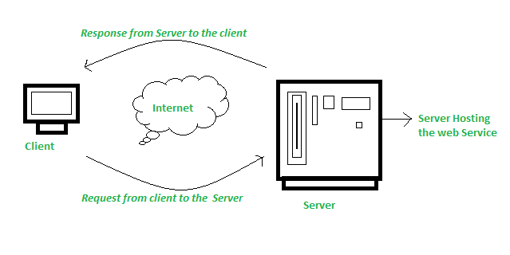
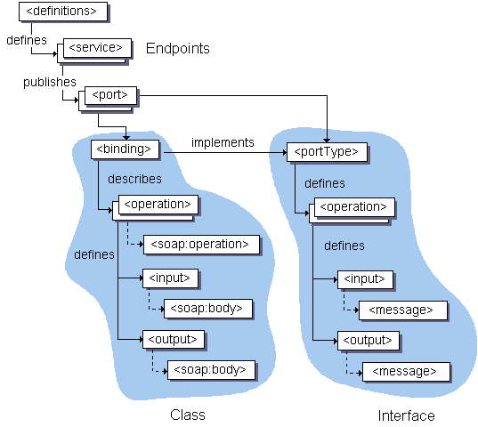

A web service is a set of open protocols and standards that allow data to be exchanged between different applications or systems. 

Web services can be used by software programs written in a variety of programming languages and running on a variety of platforms to exchange data via computer networks such as the Internet in a similar way to inter-process communication on a single computer.



### Functions of Web Services

- It’s possible to access it via the internet or intranet networks.
- XML messaging protocol that is standardized.
- Operating system or programming language independent.
- Using the XML standard, it is self-describing.
- A simple location approach can be used to locate it.

## Components of Web Services

XML and HTTP is the most fundamental web services platform. The following components are used by all typical web services:

### SOAP
- Simple Object Access Protocol
- It is an XML based protocol for accessing web services over HTTP.
- It is a messaging protocol that is used to exchange data between applications.

#### Advantages of SOAP
- Recommended by W3C Consortium and largely accepted standard.
- Lightweight protocol / based on XML.
- Platform / OS / Programming Langugage independent
- It works on top of HTTP protocol, so no extra customization required.

#### SOAP Message


#### Example
```xml
<?xml version="1.0" encoding="utf-8" ?>
<soap:Envelope xmlns:soap="http://www.w3.org/2003/05/soap-envelope">
  <soap:Header>
    <MyHeader xmlns="http://www.example.org/stock">
      <symbol>IBM</symbol>
    </MyHeader>
  </soap:Header>
  <soap:Body>
    <GetStockPrice xmlns="http://www.example.org/stock">
      <symbol>IBM</symbol>
    </GetStockPrice>
  </soap:Body>
</soap:Envelope>
```

### UDDI
- Universal Description, Discovery and Integration
- It is an XML based standard for describing, publishing and locating web services.
- It is a registry for businesses worldwide to list themselves on the internet.
- UDDI provides a repository where WSDL files can be hosted so that a client application can discover a WSDL file to learn about the various actions that a web service offers.
- As a result, the client application will have full access to the UDDI, which serves as a database for all WSDL files.
- The UDDI registry will hold the required information for the online service, just like a telephone directory has the name, address, and phone number of a certain individual. So that a client application may figure out where it is.

### WSDL
- Web Service Description Language
- It is an XML notation for describing a web service.
- A WSDL definition tells a client how to compose a web service request.
- Describes the interface that is provided by web service provided.

#### Why WSDL ?
 The client invoking the web service should be aware of the location of the web service.  
 Second, the client application must understand what the web service does in order to invoke the correct web service.  
 The WSDL, or Web services description language, is used to accomplish this. 




### ebXML
- Electronic Business XML
- It is a global standard for electronic business that enables anyone, anywhere to do business transactions with anyone over the internet.
- End to end B2B XML framework.
- Relies on existing standardsL HTTP, TCP/IP, MIME, SMTP etc.
- Can be implemented and deployed on virtually any computing platform.
- Provides **concrete specifications** to enable dynamic B2B collaborations.
