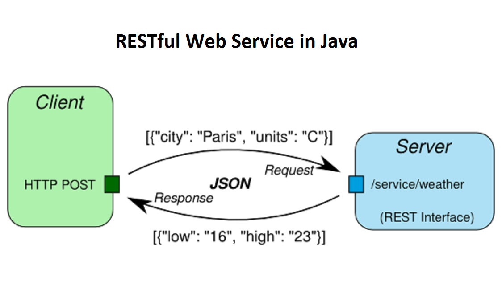

## REST
- Represntational State Transfer ( set of constraints)
- An architectural style protocol thhat uses XML or JSON to send and receive data.
- Simply calls resources via URL pattern.
- Result is readble which is just plain XMl or JSON.
- Transfer is over HTTP or HTTPS only.
- Easy to call from any programming languages.
- Performance is much better compared to SOAP.
- Used for light-weight applications like mobile applications, where processing is required at very high speed.
- For different CRUD operations, it is easy to implement through follwing HTTP methods:

| Operation | HTTP Method |
| ---- | ---- |
| Select | GET |
| Create | POST |
| Update | PUT |
| Delete | DELETE |
| Search | GET |
| List | GET |
| Count | GET |
|  |  |

- Implementations: Spring Restful, Django Rest Framework etc.



## Payload in RESTful
- A payload is a data sent over the internet.
- When a payload is heavy, it requires more resource.
- REST tends to use HTTP  & JSON which lighten the payload.


## REST API
- A REST API (also known as RESTful API) is an application programming interface (API or web API) that conforms to the constraints of REST architectural style and allows for interaction with RESTful web services.
- It uses HTTP methods to access and use data.

## Concept and Properties
### Resource Providers
- Server that provide resource is resource provider.
- Eg: AWS, Azure etc.

### Resource
- Can be anything such as web pages, Javascript, data.
- resource will have name and unique path.

### Resource Representation
- Resource representation is a way to represent resource.
- Useful information about the current state of thte resource, specified with specific format, in a specific laguage.

### Resource Link and Connectedness
- Resource link means link to the another resource.
- Connectedness means how reliable and relevant the resource links are.

### Statelessness
- Stateless means that the resource is not dependent on the state of the client.

### Uniform Interface
- Means all services should be accessed by the client in the same way.

## Benefits of ROA
1. Achieve performance and scalability because of statelessness.
2. Client and server will have explicit state.
3. No need to establish connection between client and server.

## SOAP vs REST
| Factor | SOAP | REST |
| --- | ---- | ---- |
| Definition | It is a complete protocol. | It is an architectural style as it needs HTTP protocol for the communication. So, it's not a protocol. |
| Architecture | - SOA | - ROA |
| | - Function Driven | - Data Driven |
| | - Exposes application as service | - Exposes resources as service |
| Protocol | Any Transfer Protocol - SOAP over HTTP, SOAP over JMS (Java Message Service) | HTTP |
| Communication | Distributed Communication | Client Server Communication | 
| Data format | Only based on XML | Supports XML, JSON, Plaintext etc. |
| Payload | It uses XML which is very complex and uses more resource | It uses HTTP and JSON so need of extra processing of Payload |
| Security | Supports WS-Security which is transport level security. | Supports ksecure version of HTTP i.e. HTTPS |
| Bandwidth | Consume or takes more bandwidth due to envelop style and WSDL files. | Light weight in terms of design. So, consume less bandwidth. |
| Caching | Envelop style requires multiple levels for caching. | Its possible to cache data easily. |
| When to use ? | Application that requires high security. Eg: Financial App etc. | Application that requires high performance, faster response, lightweight payload etc. Eg: Social Media App |
| Ease of use | - Client need information about everything before accessing services. | - Client need to know only about the payload and URI. |
|  | - Testing is difficult because of multiple levels of dependency and architecture. | - Testing is very easy. |


## RESTful Compliant Architecture
- RESTful architecture is a set of constraints that define the behavior of a RESTful web service.
- To design a RESTful web service, you need to follow these **six** constraints.
1. Uniform Interface
2. Stateless
3. Cacheable
4. Client-Server
5. Layered System
6. Code on Demand (Optional)

### Uniform Interface
- All services should be accessed by the client in the same way.
- For eg: Mobile phone interacts with the servers same way as the laptop interacts with the servers i.e. by using GET, POST, PUT and other HTTP methods.
- Eg: 
    ```
    GET /employees/1
    ```
    returns 
    ```json
    {
    "id": 1,
    "name": "John",
    "age": 30
    }
    ```

### Statelessness
- Server does not depend on the state of the client.
- All the information to understand a request is contained within a request.

### Cacheable
- Server can cache the information to speed up the response.
- Reduces network latency (access latency).
- Also, client is free to store the responses in the cache, and can retrieve them later without re-sending the request to server.

### Client-Server
- REST Application should have client-server architecture.
- Client and server should be separated. So that client need not to worry about business logic and servers need not to know about the representation (frontend).

### Layered System
- Allows architecture to be composed of hierarchies of layers.
- Each layer doesn't know anything about other layer.
- Limit the complexity within the layer.
- Increases latency - Disadvantage.

### Code on Demand (Optional)
- The servers can provides execitable code to the client on demand.
- Reduces Abstraction.
