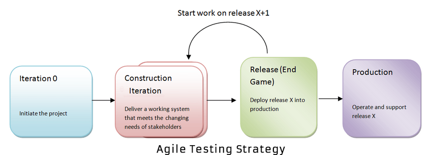

## Introduction

AGILE software development is an approach to software devlopment under which requirements and solution evolve throught the collaborative effort of self organizing and cross functionalities and their customer/end users.

The key in AGILE technique is compressing the five sequences of the conventional software development method called Waterfall method to about one week cycle.  
It manages to do this by developing a system through repetitive cycle (iterative) and in small portions (incremental), allowing developers to test and review during development.

## Principles
The manifesto for AGILE Software Development is based in 12 Principles.

1. Customer Satisfaction by early and continous deliveryof valuable software.
2. Welcome changing requirement even in late development.
3. Deliver working software frequently (weeks rather than month).
4. Close and daily co-operation between customer and developer.
5. Projects are build around motivated individuals whom could be trusted. 
6. Face to face conversation is best form of communication co-location.
7. Working software is the primary measure of progress.
8. Sustainable development would able to maintain a constant pace.
9. Continous attention to technical excellence of good design.
10. Simplicity-the art of maximizing the amount of work not done–is essential .
11. Best Architectures, Requirements and design emerge from self organizing teams.
12. Regularly Reflect and Adjust Your Way of Work to Boost Effectiveness.

## Methodologies
1. Scrum
2. XP
3. FDD (Feature Driven Development)
4. Lean and Kanban Method.
5. DSDM (Dynamic System Development Method)
6. ASD (Adaptive Software Development)
7. Agile Unified Process

## Practices
1. Test Driven Development
2. Peer Programming
3. Behaviour Driven Development
4. Acceptance Test Driven Development
5. Continous Integration

## Agile Testing
AGILE TESTING is a testing practice that follows the rules and principles of agile software development. 
Unlike the Waterfall method, Agile Testing can begin at the start of the project with continuous integration between development and testing. 
Agile Testing methodology is not sequential (in the sense it’s executed only after coding phase) but continuous.

### Agile Test Plan

Agile test plan includes types of testing done in that iteration like test data requirements, infrastructure, test environments, and test results. Unlike the waterfall model, in an agile model, a test plan is written and updated for every release. Typical test plans in agile includes

- Testing Scope
- New functionalities which are being tested
- Level or Types of testing based on the features complexity
- Load and Performance Testing
- Infrastructure Consideration
- Mitigation or Risks Plan
- Resourcing
- Deliverables and Milestones

### Agile Testing vs Waterfall Testing
| Agile Testing                                                              | Waterfall Testing                                                                      |
| -------------------------------------------------------------------------- | -------------------------------------------------------------------------------------- |
| In agile testing, testing is not a separate phase.                         | In waterfall testing, testing is a separate phase.                                     |
| In agile testing, testing is performed alongside the development.          | In waterfall testing, testing is carried out only after the completion of development. |
| In agile testing, development team and testing team work together.         | In waterfall testing, development team and testing team work separately.               |
| In agile testing, testers are involved in the requirements.                | In waterfall testing, testers may or may not be involve in the requirements..          |
| In agile testing, acceptance testing is carried out after every iteration. | In waterfall testing, acceptance testing is carried out only in the end.               |
| In agile testing, regression testing is carried out after every iteration. | In waterfall testing, regression testing is carried out only in the end.               |
| In agile testing, there is no time delays between coding and testing.      | In waterfall testing, there is normal time delays between coding and testing.          |
| In agile testing, different testing levels overlap.                        | In waterfall testing, testing levels can’t overlap.                                    |

### Agile Testing vs V Testing
| Agile Model                                                                       | V-Model                                                                               |
| --------------------------------------------------------------------------------- | ------------------------------------------------------------------------------------- |
| It is software development model in which development and testing are concurrent. | It is also software development model but development and testing are not concurrent. |
| It consists of different sprints.                                                 | It has two phases Verification and Validation.                                        |
| Testing is easy as compared to V-model.                                           | Testing is hard as compared to Agile model.                                           |
| It consists of total five phases.                                                 | It consists of five verification and five validation phases.                          |
| Communication is easy between end users, development team and testing team.       | Development team and testing team don’t interact much with end users.                 |
| Developers ans testers are dependent on each other.                               | Developers and testers are independent.                                               |
| It is iterative.                                                                  | It is not iterative.                                                                  |
| It is incremental.                                                                | It is not incremental.                                                                |
